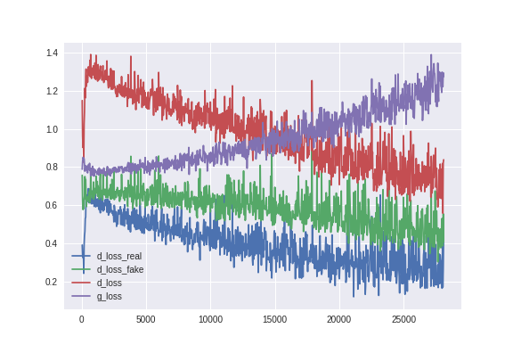
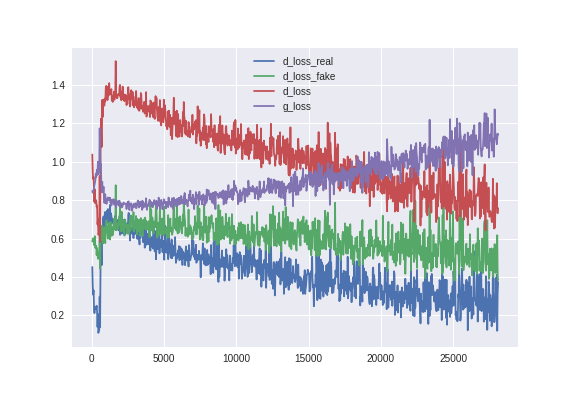
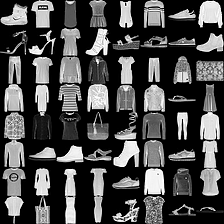

## Generative Adversarial Network

In this assignment, the goal is to generate random but distinctive and clear images mimicking from the fashion MNIST. There are many generative models that have been researched on in recent years, but here we will focus on the application of **Generative Adversarial Network (GAN)**.

The idea of GAN is to design two convolution networks:

1. _Discriminator :_  
Differentiate inputs from the real source (fashion MNIST) and from fake generated images from the _generator_ function.

2. _Generator :_   
Generate fake images (from normal distribution) that aimed to mimic images from the source.

Hence, the discriminator is trained to recognize real image from the fake ones while the generator is trained to produce images that are closer each step to the original source until they are indistinguishable. 

_Tensorflow_ is used to utilise the useful function defined in the package for the convolutional neuron network in discriminator and generator functions.

Firstly, we need to include some necessary packages like tensorflow and numpy for the neuron network. Next, extract data from the idx files from fashion MNIST as numpy arrays. Note that only the actual training data (training and test set are concatenated and treat as the training data) are needed for GAN. Their labels are included for completeness.

### Some handling functions

Some side functions that do not directly involved on the training like handling and saving images are pre-defined to simplify the training code.

### Main Functions 

Now, we define some important functions that set the core of the convolutional network in _discriminator_ and _generator_. The activation function used here is leaky ReLU as suggested in []. 

### Main training functions using _GAN_

Define a _GAN_ class and create the functions _discriminator_ and _generator_ with convolutional and deconvolutional layer with some specific strides and same padding are used. 

#### Hyper-parameters

Adam Optimizer  
 - Learning rate : 0.0002
 - Beta : 0.5
 
Height and width dimension of MNIST image : 28
 
Number of generated image to be saved : 64
 
Batch size : 64

Total number of training epoch : 30

dimension of noise vector : 62

### Difference between using uniform or normal initializer

According to the original source of the code for *GAN*, the initializer from uniform distribution is used and the training curve in terms of the loss function for both _generator_ and _discriminator_ is shown in Figure 1. 

However, as stated in the lectures of this course, researher found that using sample from a gaussian distribution (normal) would improve the result. This is proved by the graph of training curve using _normal_ initializer as shown in Figure 2. It can be seen that in Figure 2, the loss of generator increase slower than that of Figure 1 where _uniform_ distribution is used. The fluctuation of the losses are also generally lower using normal initializer. However, The generator loss still exceed the loss of discriminator eventually in both figures.

<figure>
  <figcaption>Figure 1 : Losses from uniform initializer</figcaption>
  
</figure>

<figure>
  <figcaption>Figure 2 : Losses from normal initializer</figcaption>
  
</figure>

## Result

Images are  generated during the training and the corresponding images from the generator _after_ epoch 0 to 29 are displayed in Figure 3 below. It can be seen that the images improved in quality after the trainings. 

Comparing the original images from the MNIST data in Figure 4, it is certainly undistinguished from the human eye. Even though the graphs show that generators practically lost to the discriminator as the discriminator have been trained enough to be able to distinguish real images and the images provided by generator. 

<figure>
  <figcaption>Figure 3 : Generated images from epoch 0 to 29:</figcaption>
  Generated images after epoch 0:
   Generated images after epoch 5:
   Generated images after epoch 10:
   Generated images after epoch 15:
   Generated images after epoch 20: 
   Generated images after epoch 25:
   Generated images after epoch 29:
  
</figure>

<figure>
  <figcaption>Figure 4: original image picked from the data</figcaption>
  
</figure>

## WGAN 

Now, we divert our focus on a slightly altered GAN method is explored in WGAN.(Wessertain-GAN). The code for WGAN is similar to that of GAN. The difference is as follows:

- Weight clipping of discriminator variable with parameters (0.01,0.01)
- Discriminator is trained more than the Generator
- Loss function is calculated directly without cross entrophy
- RMSProp is used as optimizer instead of Adam with parameter 0.00005 for learning rate and 0.9 for decay parameter

The resulting generated images from each 5 epoch is as shown in Figure 5. The quality of the images are generally poorer than that generated by using GAN. However, as shown in the Figure 6 for the loss function for genrator and discriminator using method WGAN show that the _gloss_ and _dloss_ both decrease in magnitude.

<figure>
  <figcaption>Figure 5 : Generated images using WGAN from epoch 0 to 29:</figcaption>
  Generated images after epoch 0:
   Generated images after epoch 5:
   Generated images after epoch 10:
   Generated images after epoch 15:
   Generated images after epoch 20: 
   Generated images after epoch 25:
   Generated images after epoch 29:
  
</figure>

<figure>
  <figcaption>Figure 6 : Losses from WGAN</figcaption>
  
</figure>

## Conclusion

Although the discriminator in the GAN method outsmart the generator in this case, the generated images show close resemblence from the original image to the naked eyes. As for WGAN, the loss of generator has been successfully decreased using weight clipping and a different approach to the loss function despite the fact that the image are not clear enough. There are many other improved version of GAN which could improve some of the disadvantages of these two GAN methods discussed in this assignment.

## Reference: 

1. [Tensorflow generative model collection](https://github.com/hwalsuklee/tensorflow-generative-model-collections)

2. [GAN hacks](https://github.com/soumith/ganhacks)
